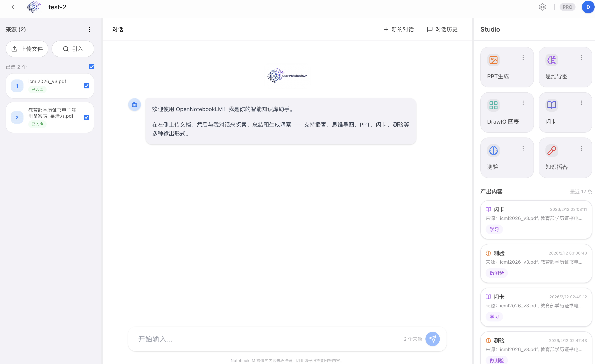
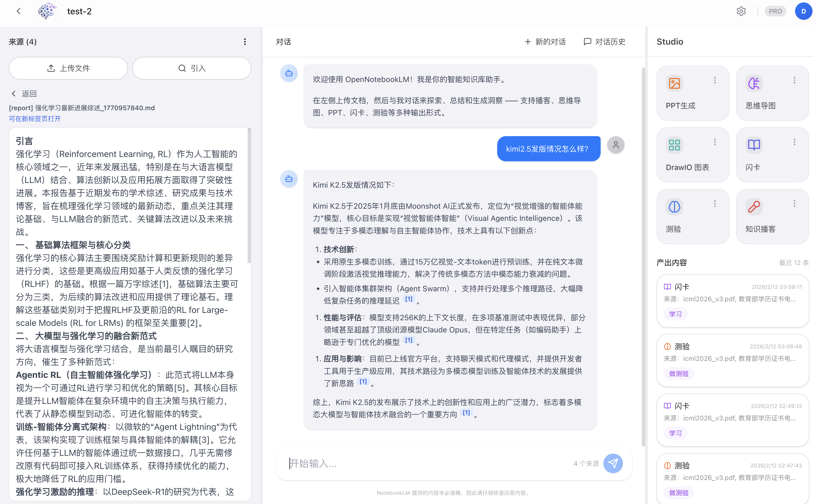
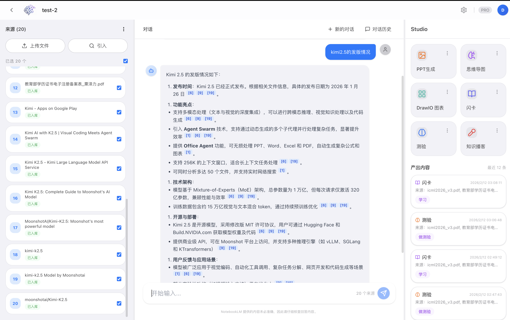
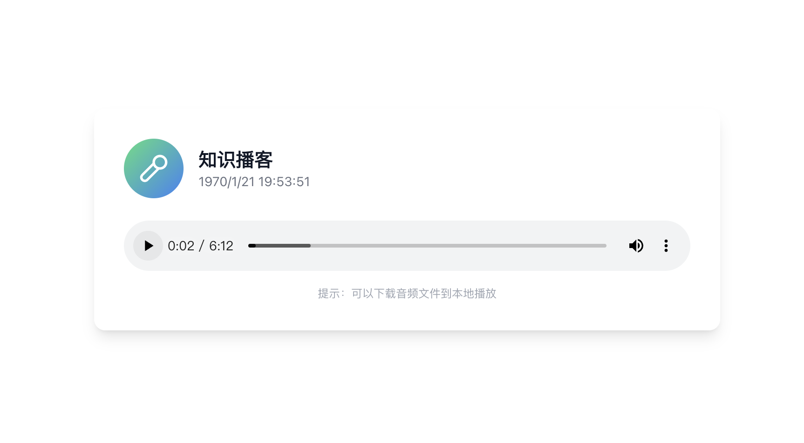
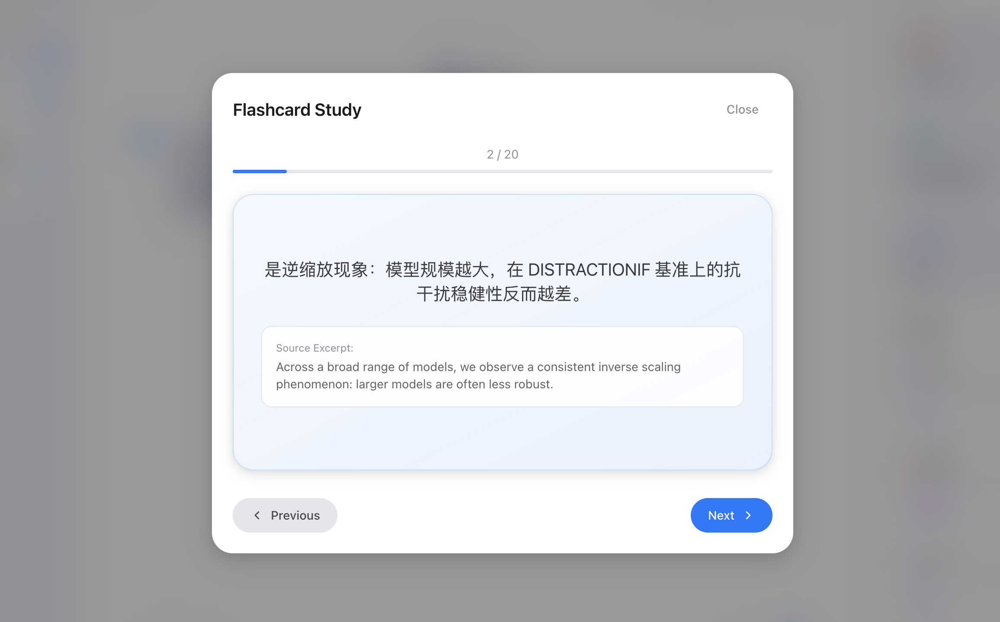
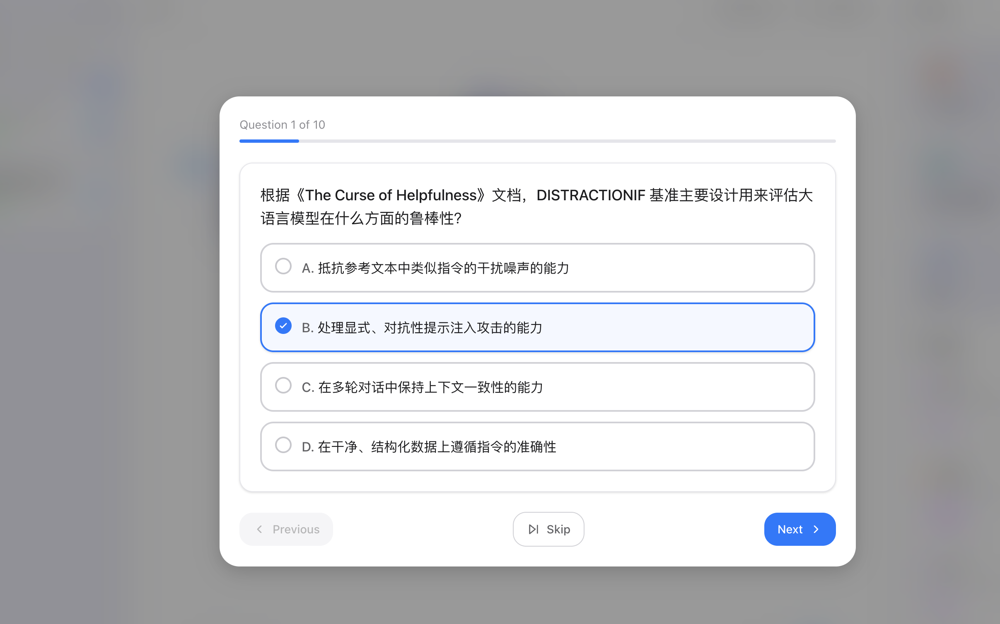
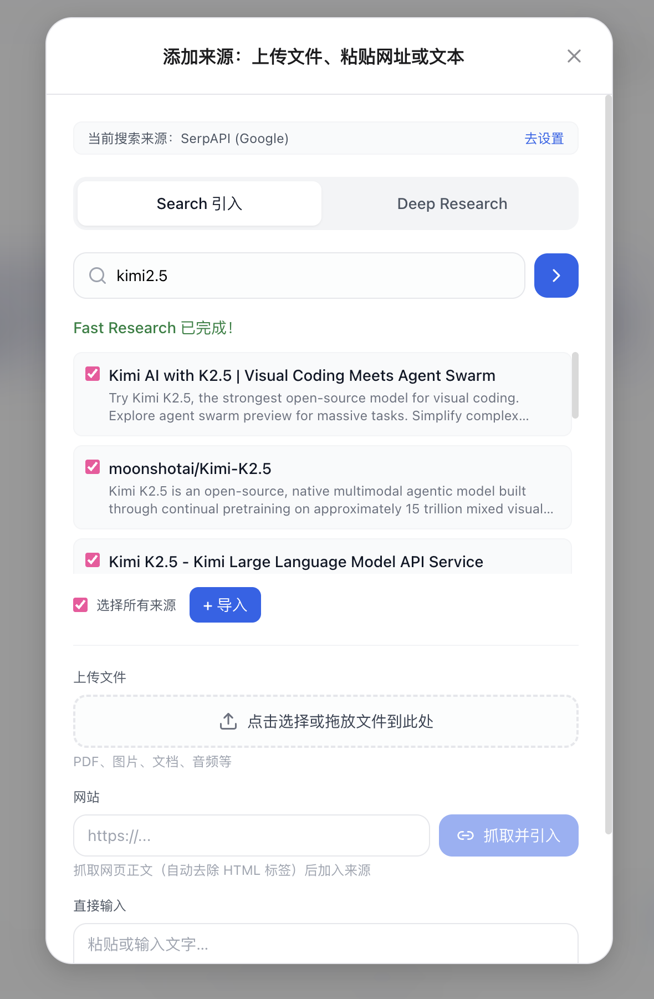
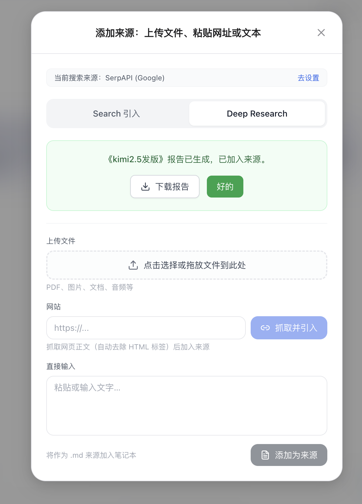

<div align="center">


# OpenNotebookLM

[](https://www.python.org/)
[](https://nodejs.org/)
[](LICENSE)

[中文](README.md) | English

**Open-source NotebookLM alternative** — Upload documents, chat with sources, generate PPTs / mind maps / podcasts / DrawIO diagrams / flashcards / quizzes / deep research reports in one click

</div>

---

## 📸 Screenshots

<div align="center">

<p><em>Dashboard — Notebook management</em></p>
</div>

<div align="center">

<p><em>Notebook workspace — Knowledge base + Smart QA + One-click generation</em></p>
</div>

<details>
<summary>More screenshots</summary>

<div align="center">

<p><em>Source import — Upload files / paste URLs / text / web search</em></p>
</div>

<div align="center">

<p><em>Generation panel — Multiple output formats</em></p>
</div>

<div align="center">

<p><em>Chat and knowledge base details</em></p>
</div>

<div align="center">

<p><em>PPT generation</em></p>
</div>

<div align="center">

<p><em>Mind map</em></p>
</div>

<div align="center">

<p><em>DrawIO diagram — Inline editor</em></p>
</div>

<div align="center">

<p><em>Knowledge podcast</em></p>
</div>

<div align="center">

<p><em>Flashcard study</em></p>
</div>

<div align="center">

<p><em>Quiz</em></p>
</div>

<div align="center">

<p><em>Web search to import sources</em></p>
</div>

<div align="center">

<p><em>Deep research report generation</em></p>
</div>

</details>

---

## ✨ Core Features

| Feature | Description |
|---------|-------------|
| 📚 **Knowledge Base** | Upload PDFs, paste URLs/text, import from web search — aggregate multiple sources into a notebook |
| 💬 **Smart QA** | RAG-based Q&A grounded in selected documents, with persistent chat history |
| 🎨 **PPT Generation** | One-click editable slide decks from knowledge base content |
| 🧠 **Mind Maps** | Generate Mermaid mind maps with preview and export |
| 🎙️ **Knowledge Podcast** | Turn knowledge base content into podcast scripts and narration assets |
| 🧩 **DrawIO Diagrams** | Generate editable DrawIO diagrams from text or images, with inline editor |
| 🃏 **Flashcards** | Auto-generate study flashcards from knowledge base content |
| 📝 **Quizzes** | Auto-generate multiple-choice questions with scoring |
| 🔍 **Web Search** | Supports Serper / SerpAPI / Google CSE / Brave / Bocha search providers |
| 📊 **Deep Research Reports** | Web search + LLM synthesis to produce structured research reports |
| 🔗 **Semantic Search** | Local embedding-based vector retrieval with configurable Top-K and models |

---

## 🚀 Quick Start

### 1. Clone & Install

```bash
git clone https://github.com/your-org/opennotebookLM.git
cd opennotebookLM

# Create virtual environment (Conda recommended)
conda create -n opennotebook python=3.11 -y
conda activate opennotebook

# Install Python dependencies
pip install -r requirements-base.txt
pip install -e .
```

### 2. Configure API Keys

```bash
cp fastapi_app/.env.example fastapi_app/.env
```

Edit `fastapi_app/.env` with at least the following:

#### LLM API (Required)

The project calls LLMs via an OpenAI-compatible API. By default it uses [APIyi](https://www.apiyi.com) as a relay service (supports GPT / Claude / Gemini and more).

```env
# LLM API endpoint (OpenAI-compatible format)
DEFAULT_LLM_API_URL=https://api.apiyi.com/v1

# Your API key (obtain from APIyi or another LLM provider)
# Can also be configured dynamically in the frontend settings panel
```

> You can use any OpenAI-compatible API service (OpenAI official, Azure OpenAI, local Ollama, etc.) — just change `DEFAULT_LLM_API_URL`.

#### Search API (Required for web search features)

Web search and deep research report features require a search engine API. Any one of the following providers will work:

| Provider | Configuration | Sign up |
|----------|--------------|---------|
| **Serper** (recommended) | Env variable `SERPER_API_KEY` | [serper.dev](https://serper.dev) |
| **SerpAPI** | Pass `search_api_key` from frontend | [serpapi.com](https://serpapi.com) |
| **Google CSE** | Pass `search_api_key` + `google_cse_id` from frontend | [programmablesearchengine.google.com](https://programmablesearchengine.google.com) |
| **Brave Search** | Pass `search_api_key` from frontend | [brave.com/search/api](https://brave.com/search/api) |
| **Bocha** | Pass `search_api_key` from frontend | [open.bochaai.com](https://open.bochaai.com) |

Serper is configured via a backend environment variable. Other providers can be set in the frontend settings panel.

```env
# Serper (Google search), recommended
SERPER_API_KEY=your_serper_api_key
```

#### Supabase (Optional)

For user authentication and cloud storage. Without it, the app uses a local mock user — all core features still work.

```env
SUPABASE_URL=https://your-project-id.supabase.co
SUPABASE_ANON_KEY=your_supabase_anon_key
```

### 3. Start Backend

```bash
uvicorn fastapi_app.main:app --host 0.0.0.0 --port 8000 --reload
```

On startup, the backend automatically launches a local embedding service (Octen-Embedding-0.6B on port 17997). The model is downloaded on first run. To disable local embedding, set `USE_LOCAL_EMBEDDING=0`.

- Health check: http://localhost:8000/health
- API docs: http://localhost:8000/docs

### 4. Start Frontend

Both English and Chinese frontends are provided — pick either:

```bash
# English frontend
cd frontend_en && npm install && npm run dev

# Chinese frontend
cd frontend_zh && npm install && npm run dev
```

Open http://localhost:3000 (or the port shown in the terminal).

> The LLM API URL and API key can be changed dynamically in the settings panel (top-right corner) without restarting.

---

## 📂 Project Structure

```
opennotebookLM/
├── fastapi_app/             # Backend API (FastAPI)
│   ├── routers/             #   Routes: KB, Paper2PPT, Paper2Drawio, etc.
│   ├── services/            #   Business logic: search, flashcards, quizzes, etc.
│   ├── config/              #   Configuration & environment variables
│   └── workflow_adapters/   #   Workflow adapter layer
├── dataflow_agent/          # Workflow engine (DataFlow-Agent)
│   ├── agentroles/          #   Agent role definitions
│   ├── workflow/            #   Workflows (Paper2PPT, PDF2PPT, Image2Drawio, etc.)
│   ├── promptstemplates/    #   Prompt templates
│   └── toolkits/            #   Toolkits (search, parsing, etc.)
├── frontend_en/             # English frontend (React + Vite + Tailwind)
├── frontend_zh/             # Chinese frontend
├── database/                # Database scripts
├── docs/                    # Documentation
├── script/                  # Utility scripts
├── static/                  # Static assets
└── outputs/                 # Generated file output directory
```

---

## ⚙️ Model Configuration

The project uses a three-layer model configuration system, from coarse to fine-grained:

1. **Base model layer** — Define available model names (`MODEL_GPT_4O`, `MODEL_CLAUDE_HAIKU`, etc.)
2. **Workflow layer** — Set default models per workflow (`PAPER2PPT_DEFAULT_MODEL`, etc.)
3. **Role layer** — Fine-grained control over each role within a workflow (`PAPER2PPT_OUTLINE_MODEL`, etc.)

See `fastapi_app/.env.example` for the full configuration reference.

---

## 🤝 Contributing

Issues and pull requests are welcome. See [Contributing Guide](docs/contributing.md).

---

## 📄 License

[Apache License 2.0](LICENSE)

Generation features are built on [OpenDCAI/Paper2Any](https://github.com/OpenDCAI/Paper2Any).

---

<div align="center">

**If this project helps you, please give it a ⭐ Star**

</div>
